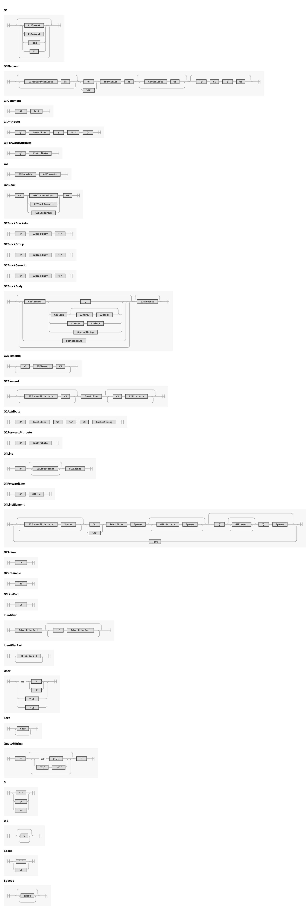

= markup
:source-highlighter: highlight.js
:highlightjs-languages: asciidoc, abnf
:toc:
Torben Schinke

This article proposes a new general purpose markup language,
which can be used to write texts but also allows to efficiently express domain specific languages.

== Motivation

=== Why not HTML?
HTML was neither designed for print nor for building DSLs. Even, as of today and the according print media query,
there are a lot of shortcomings, like proper typesetting, page breaks or even page numberings.

=== Why not XML (or formats using it, like DocBook)?
XML as a standard is very complex. Self-contained descriptions like Req-If or OOXML are actually impossible to be
written by hand. Also, it is very verbose by design. DSLs are impossible to express in a readable way. When
thinking about it, it is astonishing how successful XML became, despite it is hard to be read by humans and
even hard and expensive to process.

=== Why not Markdown?
The actual Markdown standard is pretty small and does not even contain things like footnotes or tables. Therefore,
a lot of incompatible flavors have been created. Also, there is an obvious focus on HTML transformation.

=== Why not AsciiDoc?
There is no context free grammar, which makes it hard to parse. Besides the reference implementation, there is not
even a specification. It looks like, that one needs more than https://github.com/asciidoctor/asciidoctor/issues/61#issuecomment-373576992[64 parsers] to build an AST. There are other edge cases
which cannot be fixed, like proper https://github.com/asciidoctor/asciidoctor/issues/901[escaping]. These bugs
are unaddressed since more than 8 years now. Others try to create parsers for it, e.g. by using
https://github.com/bytesparadise/libasciidoc[PEG Parsers], which results in parsers with more than 64 thousand lines
of code and still fails to support even the most basic https://github.com/bytesparadise/libasciidoc/issues/290[features].

=== Why not another lightweight markup language?
It looks like that there are more than 20 popular ones. I only did a superficial check of their syntax, but all them seem to fall short, when it comes to arbitrary complexity and unambiguous parsing.

=== Why not JSON, YAML, TOML or others?
Non-markup formats are not suited for mixing text and annotated text fragments (well, markup). If one has to express
that with an object notation format, you need to create recursive holder objects and a lot of escaping. It is not
feasible to write this by hand.

== Approach

The core idea of XML, to have text with markup which can be parsed unambiguously, is really great.
So lets keep that idea but remove complexity:

* Remove verbose repetition of closing declaration (</elem>).
* Remove redundant node closing characters (>).
* Remove namespaces, different charsets, cdata, preamble, entities, processing directive.
* Remove redundant document root element.
* Introduce some rules to automatically express nesting without the need of explicit declaration.

== Specification

The text encoding is always UTF-8. In general, each valid markup can be lossless transformed (besides exact whitespace)
into XML but not the other way round.
There are two grammars, which express both the same structures but have both clear tradeoffs.
The default grammar is suited for _text first_ content, so the writer can focus on his natural
language and enrich it with markup declarations. All white-spaces within an elements block are
significant, because their rendering depends on later transformation and styling
(see also the white-space processing model of https://drafts.csswg.org/css-text-3/#white-space-phase-1[html5/CSS]).

The grammar has two modes, text first (G1) and node first (G2). By default, a document is written in G1, but parts can be switched to G2 by using '#!'. See the formal grammar in link:dyml.ebnf[] for more details or the examples below to get a feeling for the grammar.
The following railroad diagram was generated from the grammar.

=== Examples

==== Example 1
A simple hello world
[source,dyml]
----
#? saying
   hello world

#hello{world}
----

Transforms to:

[source,xml]
----
<root>
<!-- saying
     hello world

-->
<hello>world</hello>
</root>
----

==== Example 2
A book example.

[source,dyml]
----
#book {
  #toc{}
  #section @id{1} {
    #title {
        The sections title
    }

    The sections text.
  }
}
----

Transforms to (some whitespace indents may vary):

[source,xml]
----
<root>
    <book>
        <toc/>
        <section id="1">
            <title>
                The sections title
            </title>

            The sections text.
        </section>
    </book>
</root>
----

==== Example 3
A more complex book example, could be a DocBook.

[source,dyml]
----
#book @id{my-book} @author{Torben} {
    #title A very simple book
    #chapter @id{ch1} {
        #title Chapter One
        #p Hello paragraph.
        Still going on.
    }

    #chapter @id{ch2} {
        #title Chapter Two
        Some #red{#bold Text} text.
        The #span @style{color:red} { #span @style{font-weight:bold} Text } text.
        #image @width{100%} https://worldiety.de/favicon.png
    }
}
----

Transforms to (some whitespace indents may vary):

[source,xml]
----
<root>
    <book id="my-book" author="Torben">
        <title>A very simple book</title>
        <chapter id="ch1">
            <title>Chapter One</title>
            
Hello paragraph.
            Still going on.

        </chapter>

        <chapter id="ch2">
            <title>Chapter Two</title>
            Some <red><bold>Text</bold></red> text.
            The Text  text.
            <image width="100%">https://worldiety.de/favicon.png</image>
        </chapter>
    </book>
</root>
----

==== Example 4
The parser can be toggled between two modes (more markup or more text),
so a writer can decide which reads best in the current context.

[source,dyml]
----
#list{
  #item1{#key{value}}
  #item2 @id{1}
  #item3 @key{value}
}
----

is equivalent to
[source,dyml]
----
#! list {
    item1 key "value",
    @@id="1"
    item2,
    item3 @key="value",
}
----

Transforms to (some whitespace indents may vary):
[source,xml]
----
<root>
   <list>
        <item1><key>value</key></item1>
        <item2 id="1"/>
        <item3 key="value"/>
   </list>
</root>
----

==== Example 5
This shows, how neat the _node first_ DSL is

[source,dyml]
----
just a text line
#! type {
    ## This is a forward text node. It contains a non-recursive grammar 1, so e.g. #ref{id} is possible.
    Person struct {
        ## ...is the first name
        Firstname int32

        ## ...come get some.
        @@stuff ...is the stuff parameter.
        @@other="...os the other parameter."
        func Get(stuff string, other int, list Map<X,Y>) -> (int32, error)
    }
}
----

[source,xml]
----
<root>
    just a text line
    <type>
        <Person>
            This is a forward text node. It contains a non-recursive grammar 1, so e.g. <ref>id</ref> is possible.
            <struct _groupType="{}">
                <Firstname>
                    ...is the first name
                    <int32/>
                </Firstname>

                <func stuff="...is the stuff parameter." other="...is the other parameter.">
                    ...come get some.
                    <Get _groupType="()">
                        <stuff><string/></stuff>
                        <other><int/></other>
                        <list><Map _groupType="<>"><X/><Y/></List></list>
                        <ret _token="->" _groupType="()">
                            <int32/>
                            <error/>
                        </ret>
                    </Get>
                </func>
            </struct>
        </Person>
    </type>

</root>
----

== Lightweight markup specification
Nesting is no fun, so a linear structure makes reading easier.

=== Documents
Just plain text, is a valid document.
[source]
----
This is a basic dyml document.
----

[source]
----
This is a basic dyml document.

This document contains two paragraphs (depends on the actual renderer).
----

[source]
----
#title{Document Title}

This is a basic dyml document.
----

=== Blocks

[source]
----
#title{Document Title}

#section{A section title}
This is the sections content.

Everything until the next section block or the subsection or subsubsection (etc.).

#subsection{Inside the section}

#section{Subsection done, next sibling section}
Just like latex, AsciiDoc or Markdown. Even though this can never
be parsed immediately as a block, a post-parser will derive the correct
nesting logic.
----

== Schema Validation
TODO: Notation is complex and arbitrary, but for many DSLs a schema validation would be a useful thing.

* Parser may validate the structure and also various types like bool, int, date, regex etc.
* a complex document may expect different schemas for each part.

